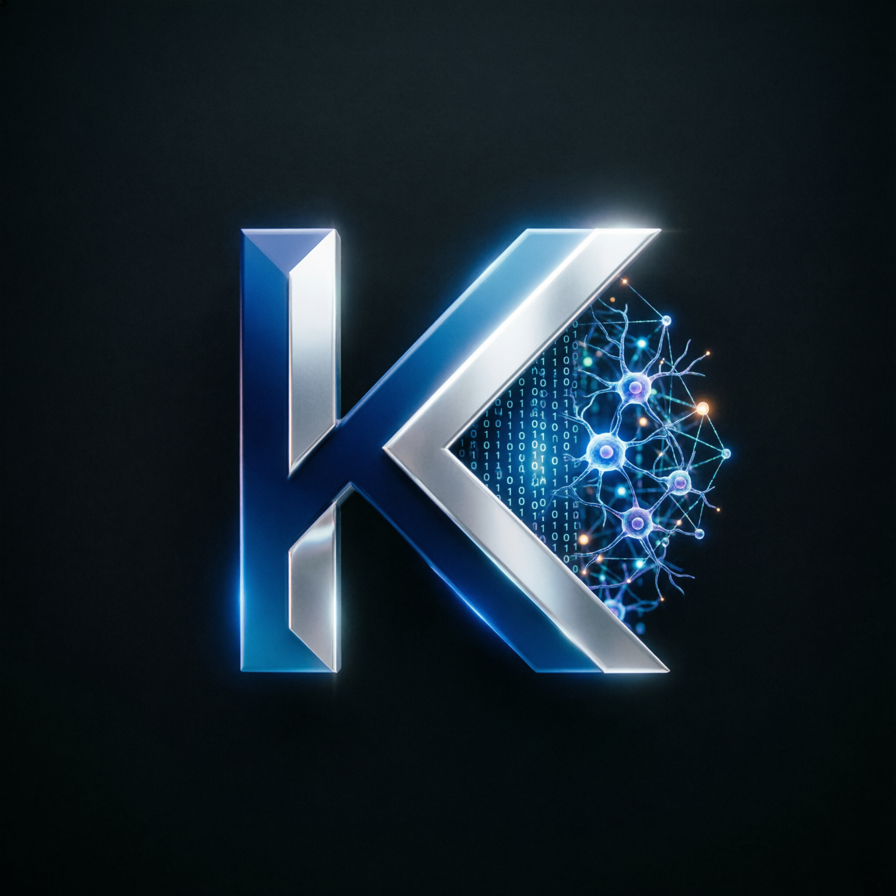

<div align="center">



# KARENA AI
### Community Decision Intelligence Platform

**APAC Generative AI Hackathon 2026 · Hack2Skill**

[](https://hack2skill.com)
[](https://github.com)
[](https://github.com)
[](https://groq.com)
[](https://tavily.com)

</div>

---

## 🎯 Problem Statement

Modern APAC communities generate massive volumes of structured and unstructured data from urban systems, healthcare networks, environmental sensors, public services, and citizen feedback. **Transforming this fragmented data into actionable decisions remains a critical challenge** for city stakeholders.

**Karena AI** solves this by unifying community data across **7 specialist domains** into a single, AI-powered decision intelligence platform — enabling individuals, communities, organisations, and city stakeholders to analyse information, generate insights, predict outcomes, and make better decisions that improve everyday life.

---

## ✨ Key Features

### 🤖 Multi-Agent Domain Intelligence
7 specialist AI agents, each with deep APAC community context:

| Domain | Agent | Key Intelligence |
|---|---|---|
| 🚗 Urban Mobility | `UrbanMobilityAgent` | Traffic congestion, transit ridership, ATSC, EV adoption |
| 🏥 Healthcare | `HealthcareAgent` | Bed occupancy, disease surveillance, vaccination coverage |
| 🌿 Environment | `EnvironmentAgent` | AQI, carbon emissions, water quality, climate resilience |
| 👥 Citizen Services | `CitizenServicesAgent` | Service requests, digital adoption, citizen satisfaction |
| 🚨 Disaster Response | `DisasterResponseAgent` | Early warning, resource deployment, community resilience |
| 📚 Education | `EducationAgent` | Enrollment, attendance, learning outcomes, EdTech |
| ⚡ Energy & Utilities | `EnergyUtilitiesAgent` | Grid load, renewable share, NRW, smart utilities |

### 🔍 Hybrid RAG Pipeline
- **Dense retrieval** via Qdrant HNSW vector search (384-dim embeddings)
- **BM25 lexical retrieval** for keyword precision
- **Reciprocal Rank Fusion (RRF)** for optimal result merging
- **Two-stage re-ranking** for relevance refinement
- **Source traceability** with confidence scores per citation

### 🌐 Real-Time Web Search
- **Tavily** (primary) — LLM-optimised search, real-time results
- **DuckDuckGo** (fallback) — no API key required
- Toggle in chat UI — augments RAG with live web context
- Searches news, Wikipedia, research papers, government sites

### 📊 Decision Intelligence Dashboard
- 7 domain tabs with live KPI cards
- Real-time metrics from backend API (30-second polling)
- AreaChart + BarChart visualisations (recharts)
- AI-generated insights per domain
- Live alert feed
- Connected / Offline status indicator

### 🖼️ Multimodal AI Analysis
- Upload images of infrastructure damage, environmental conditions, or incidents
- Gemini Vision / GPT-4o Vision analysis
- Returns severity assessment + recommended city response actions
- Supports JPEG, PNG, WebP

### 📄 Document Intelligence
- Upload PDF (text + OCR for scanned documents), DOCX, TXT
- Real-time ingestion progress (page-by-page OCR with Tesseract)
- Async background processing with polling endpoint
- Adaptive chunking (512 tokens, 64-token overlap)

### 🔐 Enterprise Security
- PII detection compliant with **GDPR, PDPA Singapore, CCPA, HIPAA**
- DLP (Data Loss Prevention) for all document uploads and chat queries
- API key lifecycle management with SHA-256 hashing
- Full audit logging of every user interaction
- OAuth2/OIDC SSO ready (Azure AD, Google Workspace)
- Role-Based Access Control (RBAC) — 6 roles

### 📈 Predictive Analytics
- Time-series forecasting with confidence intervals
- Anomaly detection (z-score, severity classification)
- Auto-insight generation per community domain
- Upgrade path: Vertex AI AutoML, BigQuery ML

---

## 🏗️ Architecture

```
┌─────────────────────────────────────────────────────────────────┐
│  React 19 Frontend                                               │
│  Landing | Dashboard (7 domains) | Chat | Admin                 │
│  Recharts · shadcn/ui · Tailwind CSS · TypeScript               │
└────────────────────────┬────────────────────────────────────────┘
                         │ REST /api/v1  (Vite proxy)
┌────────────────────────▼────────────────────────────────────────┐
│  FastAPI Backend (Python 3.11+)                                 │
│                                                                 │
│  ┌──────────────┐  ┌──────────────┐  ┌───────────────────────┐ │
│  │  RAG Pipeline│  │  Multi-Agent │  │  Analytics Engine     │ │
│  │  Hybrid      │  │  7 Domains   │  │  Forecast + Anomaly   │ │
│  │  Dense+BM25  │  │  ADK-ready   │  │  Auto-insights        │ │
│  └──────────────┘  └──────────────┘  └───────────────────────┘ │
│                                                                 │
│  ┌──────────────┐  ┌──────────────┐  ┌───────────────────────┐ │
│  │  Web Search  │  │  Multimodal  │  │  Security Layer       │ │
│  │  Tavily+DDG  │  │  Gemini      │  │  PII·DLP·Audit·RBAC   │ │
│  └──────────────┘  └──────────────┘  └───────────────────────┘ │
└───────┬─────────────────────┬───────────────────┬──────────────┘
        │                     │                   │
   Qdrant Cloud          SQLite/Postgres      Redis Cache
  (Vector Store)         (Memory+Audit)      (optional)
```

---

## 🛠️ Google Cloud & Technology Stack

| Category | Technology |
|---|---|
| **LLM** | Groq LLaMA 3.3 70B (OpenAI-compatible) / Gemini 2.0 Flash |
| **Vision AI** | Gemini Vision / GPT-4o multimodal |
| **Agent Framework** | Google ADK-compatible multi-agent architecture |
| **Vector Search** | Qdrant Cloud HNSW (upgrade: Vertex AI Matching Engine) |
| **Embeddings** | sentence-transformers/all-MiniLM-L6-v2 (384-dim) |
| **Web Search** | Tavily API + DuckDuckGo fallback |
| **Deployment** | Cloud Run / GKE via Terraform |
| **Observability** | OpenTelemetry + Prometheus + Grafana |
| **CI/CD** | GitHub Actions |

---

## 🚀 Quick Start

### Option A — No Docker (Recommended for local dev)

```bash
# Backend
cd backend
python -m venv .venv

# Windows
.\.venv\Scripts\activate

# macOS/Linux
source .venv/bin/activate

pip install -r requirements.txt
copy .env.example .env     # Windows
# cp .env.example .env     # macOS/Linux

# Edit .env — set LLM_PROVIDER, API keys
mkdir data
python run.py
# API: http://localhost:8080/docs
```

```bash
# Frontend (new terminal)
cd app
npm install
npm run dev
# App: http://localhost:3000
```

### Option B — Docker Compose

```bash
docker compose up --build
```

---

## ⚙️ Environment Configuration

```env
# LLM Provider
LLM_PROVIDER=openai
OPENAI_API_KEY=gsk_...                          # Groq API key (free)
OPENAI_BASE_URL=https://api.groq.com/openai/v1
OPENAI_MODEL=llama-3.3-70b-versatile

# Or: Google Gemini
# LLM_PROVIDER=google
# GOOGLE_API_KEY=your-google-api-key
# GOOGLE_MODEL=gemini-2.0-flash

# Vector Store
VECTOR_STORE=qdrant                             # or "memory" for dev
QDRANT_URL=https://your-cluster.qdrant.io:6333
QDRANT_API_KEY=your-qdrant-api-key

# Web Search
TAVILY_API_KEY=tvly-...                         # Free: 1,000 searches/month

# Auth
REQUIRE_AUTH=false
JWT_SECRET=change-in-production
```

---

## 📡 API Endpoints

| Method | Endpoint | Description |
|---|---|---|
| `GET` | `/api/v1/health` | System health + vector DB status |
| `POST` | `/api/v1/chat` | RAG query + optional web search |
| `GET` | `/api/v1/analytics/domains` | List 7 community domains |
| `GET` | `/api/v1/analytics/snapshot` | Live metrics snapshot (all domains) |
| `GET` | `/api/v1/analytics/insights/{domain}` | AI-generated domain insights |
| `POST` | `/api/v1/analytics/forecast` | Time-series forecasting |
| `POST` | `/api/v1/analytics/anomalies` | Anomaly detection |
| `POST` | `/api/v1/analytics/query` | Domain-routed multi-agent query |
| `POST` | `/api/v1/analyze/image` | Gemini Vision multimodal analysis |
| `GET` | `/api/v1/analyze/status` | Vision capability status |
| `POST` | `/api/v1/search/web` | Direct web search endpoint |
| `POST` | `/api/v1/ingest` | Document upload (PDF/DOCX/TXT) |
| `GET` | `/api/v1/ingest/progress/{job_id}` | Real-time ingestion progress |
| `GET` | `/api/v1/stats` | Platform admin statistics |
| `GET` | `/metrics` | Prometheus metrics |

---

## 📁 Project Structure

```
KarenaAI/
├── app/                           # React 19 frontend
│   └── src/
│       ├── pages/
│       │   ├── Landing.tsx        # Professional landing page
│       │   ├── Dashboard.tsx      # 7-domain decision intelligence dashboard
│       │   ├── Chat.tsx           # AI chat with web search + image upload
│       │   └── Admin.tsx          # Platform admin + document ingestion
│       ├── lib/
│       │   └── api.ts             # Type-safe API client
│       └── sections/              # Landing page sections
├── backend/
│   └── karena/
│       ├── agents/
│       │   └── orchestrator.py    # LLM orchestration (Groq/Gemini/Mock)
│       ├── analytics/
│       │   └── engine.py          # Forecasting + anomaly + insights
│       ├── api/routes/
│       │   ├── chat.py            # RAG chat + web search
│       │   ├── analytics.py       # Domain analytics API
│       │   ├── multimodal.py      # Gemini Vision API
│       │   ├── ingest.py          # Async document ingestion
│       │   └── search.py          # Web search API
│       ├── domains/
│       │   └── agents.py          # 7 specialist domain agents
│       ├── ingestion/
│       │   ├── parser.py          # PDF/DOCX parser + async OCR
│       │   └── jobs.py            # Ingestion job tracking
│       ├── rag/                   # Hybrid RAG pipeline
│       ├── search/
│       │   └── web_search.py      # Tavily + DuckDuckGo web search
│       └── security/              # PII, DLP, audit, RBAC
├── infrastructure/                # Kubernetes + Terraform + monitoring
└── docs/                          # Architecture + product specification
```

---

## 🗺️ Roadmap

| Phase | Status | Deliverables |
|---|---|---|
| 1 — Core RAG | ✅ Done | Hybrid retrieval, vector DB, chat UI |
| 2 — Community AI | ✅ Done | 7 domain agents, analytics, multimodal, web search |
| 3 — Production | 🔄 Next | GKE deployment, BigQuery connector, full SSO |
| 4 — Scale | 📋 Planned | Vertex AI, AlloyDB, federated multi-city deployment |

---

## 👤 About

**Team:** SovereignSwarm  
**Builder:** Ahmad Fashich Azzuhri Ramadhani  
**NIM:** 23051214209  
**Institution:** Universitas Negeri Surabaya (UNESA) — S1 Sistem Informasi  
**Event:** APAC Generative AI Hackathon 2026 · Hack2Skill  

---

<div align="center">

Built with ❤️ for APAC communities · Powered by RAG + Groq + Qdrant + Tavily

</div>
